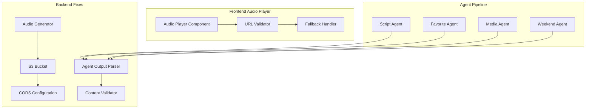

# Design Document

## Overview

The Curio News system has specific technical issues preventing proper audio playback, incomplete agent output display, and content delivery problems. This design addresses the root causes: S3 CORS configuration, audio file accessibility, agent output parsing, and content validation. The solution focuses on immediate fixes to make the demo fully functional.

## Architecture

### Current Problem Analysis

Based on console logs, the system has these specific issues:

1. **Audio Loading Failure**: `NotSupportedError: Failed to load because no supported source was found`
   - Audio URL exists but browser cannot access it
   - Likely S3 CORS or content-type issues

2. **Missing Agent Outputs**: Response lacks `agentOutputs` structure
   - Favorite story not displayed
   - Media enhancements missing
   - Weekend recommendations absent

3. **Incomplete Word Timings**: Only 3 timings for longer script
   - Transcript highlighting will fail
   - Audio synchronization broken

### Solution Architecture



## Components and Interfaces

### 1. S3 Audio Configuration Fix

**Problem**: Audio files are generated but not accessible due to CORS/permissions
**Solution**: Fix S3 bucket configuration and audio generation process

#### S3 Bucket CORS Configuration
```json
{
    "CORSRules": [
        {
            "AllowedOrigins": ["*"],
            "AllowedMethods": ["GET", "HEAD"],
            "AllowedHeaders": ["*"],
            "ExposeHeaders": ["ETag"],
            "MaxAgeSeconds": 3600
        }
    ]
}
```

#### Audio Generator Enhancements
- **Content-Type**: Ensure MP3 files have correct `audio/mpeg` content type
- **Cache-Control**: Add proper caching headers for browser compatibility
- **Public Access**: Verify S3 object ACL allows public read access
- **URL Validation**: Test audio URL accessibility before returning to frontend

### 2. Agent Output Parser and Validator

**Problem**: Agent outputs not properly parsed and included in response
**Solution**: Enhanced parsing and validation system

#### Agent Output Structure
```typescript
interface AgentOutputs {
  favoriteStory: {
    title: string;
    reasoning: string;
    highlights: string[];
  };
  mediaEnhancements: {
    stories: MediaStory[];
    visualRecommendations: string[];
  };
  weekendRecommendations: {
    books: BookRecommendation[];
    movies: MovieRecommendation[];
    events: EventRecommendation[];
    culturalInsights: CulturalInsight;
  };
}
```

#### Enhanced Agent Response Parser
```python
class AgentResponseParser:
    def parse_favorite_story(self, agent_content: str) -> dict:
        """Parse favorite selector agent response with fallback handling"""
        
    def parse_media_enhancements(self, agent_content: str) -> dict:
        """Parse media enhancer agent response with JSON extraction"""
        
    def parse_weekend_recommendations(self, agent_content: str) -> dict:
        """Parse weekend events agent response with structured data"""
        
    def validate_and_clean_output(self, parsed_data: dict) -> dict:
        """Validate parsed data and provide fallbacks for missing fields"""
```

### 3. Word Timing Generation Fix

**Problem**: Incomplete word timings (only 3 for entire script)
**Solution**: Enhanced word timing generation with proper text processing

#### Improved Word Timing Algorithm
```python
class EnhancedWordTimingGenerator:
    def generate_accurate_timings(self, script: str) -> List[WordTiming]:
        """Generate word timings with proper text processing and duration calculation"""
        
    def estimate_word_duration(self, word: str, context: str) -> float:
        """Calculate word duration based on length, complexity, and context"""
        
    def add_natural_pauses(self, timings: List[WordTiming]) -> List[WordTiming]:
        """Add natural pauses for punctuation and sentence breaks"""
```

### 4. Content Validation and Fallback System

**Problem**: Incomplete content validation leading to missing data
**Solution**: Comprehensive validation with intelligent fallbacks

#### Content Completeness Validator
```python
class ContentCompletenessValidator:
    def validate_audio_accessibility(self, audio_url: str) -> ValidationResult:
        """Test if audio URL is accessible from browser"""
        
    def validate_agent_outputs(self, outputs: dict) -> ValidationResult:
        """Ensure all required agent outputs are present and valid"""
        
    def validate_word_timings(self, timings: list, script: str) -> ValidationResult:
        """Verify word timings align with script content"""
        
    def generate_fallback_content(self, missing_sections: list) -> dict:
        """Generate high-quality fallback content for missing sections"""
```

## Data Models

### Enhanced Bootstrap Response
```typescript
interface BootstrapResponse {
  // Core content
  audioUrl: string;
  script: string;
  news_items: NewsItem[];
  word_timings: WordTiming[];
  
  // Agent outputs (previously missing)
  agentOutputs: {
    favoriteStory: FavoriteStory;
    mediaEnhancements: MediaEnhancements;
    weekendRecommendations: WeekendRecommendations;
  };
  
  // Metadata
  sources: string[];
  generatedAt: string;
  traceId: string;
  why: string;
  
  // Status and validation
  agentStatus: string;
  shouldRefresh: boolean;
  generationStarted: boolean;
  contentValidation: {
    audioAccessible: boolean;
    agentOutputsComplete: boolean;
    wordTimingsValid: boolean;
    overallQuality: number;
  };
}
```

### Audio Validation Result
```typescript
interface AudioValidationResult {
  accessible: boolean;
  contentType: string;
  fileSize: number;
  duration: number;
  error?: string;
  fallbackUrl?: string;
}
```

## Error Handling

### Audio Loading Error Recovery
1. **URL Validation**: Test audio URL before sending to frontend
2. **CORS Fix**: Apply proper CORS headers to S3 bucket
3. **Content-Type Fix**: Ensure audio files have correct MIME type
4. **Fallback Audio**: Provide working fallback audio URL if generation fails
5. **Error Reporting**: Clear error messages for debugging

### Agent Output Error Recovery
1. **JSON Parsing**: Robust parsing with fallback for malformed JSON
2. **Content Extraction**: Extract useful content even from partial responses
3. **Fallback Generation**: Generate reasonable fallback content for missing outputs
4. **Validation**: Ensure all required fields are present before sending to frontend

### Word Timing Error Recovery
1. **Text Processing**: Proper text cleaning and word extraction
2. **Duration Calculation**: Accurate timing estimation based on speech patterns
3. **Synchronization**: Ensure timings align with actual script content
4. **Fallback Timings**: Generate estimated timings if Polly timing fails

## Testing Strategy

### Audio Accessibility Testing
- **URL Testing**: Automated tests to verify audio URLs are accessible
- **Browser Compatibility**: Test audio playback across different browsers
- **CORS Validation**: Verify CORS headers allow cross-origin requests
- **Content-Type Verification**: Ensure proper MIME types for audio files

### Agent Output Testing
- **Parsing Tests**: Test agent response parsing with various input formats
- **Validation Tests**: Verify content validation catches missing or malformed data
- **Fallback Tests**: Ensure fallback content is generated when agents fail
- **Integration Tests**: Test complete agent output flow from generation to display

### Performance Testing
- **Audio Generation Speed**: Measure time from script to playable audio
- **Content Validation Speed**: Ensure validation doesn't slow down response times
- **Fallback Performance**: Test fallback content generation speed
- **End-to-End Testing**: Complete user journey from request to audio playback

## Implementation Priority

### Phase 1: Critical Audio Fix (Immediate)
1. Fix S3 CORS configuration for audio files
2. Ensure proper content-type headers on audio files
3. Add audio URL validation before returning to frontend
4. Implement fallback audio URL for failures

### Phase 2: Agent Output Completion (High Priority)
1. Fix agent output parsing and inclusion in bootstrap response
2. Implement fallback content generation for missing agent outputs
3. Add content validation to ensure complete responses
4. Test favorite story, media enhancements, and weekend recommendations display

### Phase 3: Word Timing Enhancement (Medium Priority)
1. Fix word timing generation to cover entire script
2. Improve timing accuracy for better transcript highlighting
3. Add natural pause detection and timing adjustment
4. Test transcript synchronization with audio playback

### Phase 4: Validation and Polish (Low Priority)
1. Add comprehensive content validation
2. Implement detailed error reporting and logging
3. Optimize performance and response times
4. Add monitoring and alerting for failures

This design provides a systematic approach to fixing the specific issues identified in the console logs while ensuring the system becomes fully functional for demo purposes.