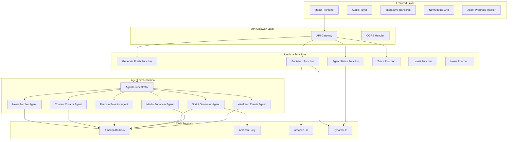

# Design Document

## Overview

Curio News is a sophisticated multi-agent AI system that demonstrates the power of AWS Bedrock Agent orchestration. The system uses 6 specialized agents working in harmony to curate, script, and deliver personalized news briefings for Gen Z/Millennial audiences. The architecture emphasizes real-time transparency, instant user gratification, and complete AI provenance tracking.

## Architecture

### High-Level System Architecture



### Smart Caching Architecture

The system implements a sophisticated caching strategy that provides instant user gratification while generating fresh content in the background:

1. **Instant Response**: Bootstrap endpoint immediately serves cached content
2. **Background Generation**: Simultaneously triggers fresh content generation
3. **Real-time Updates**: Frontend polls for agent progress and updates UI
4. **Hot Swap**: When fresh content is ready, seamlessly replaces cached content
5. **Graceful Fallbacks**: Always has working content even if generation fails

## Components and Interfaces

### Frontend Components

#### AudioPlayer Component
- **Purpose**: Custom audio player with real-time transcript highlighting
- **Features**: Play/pause controls, progress tracking, word-by-word highlighting
- **Integration**: Connects to backend APIs for content and progress updates
- **State Management**: Manages audio playback state and current time tracking

#### NewsItems Component
- **Purpose**: Displays curated news stories in an engaging grid layout
- **Features**: Category tags, relevance scores, expandable summaries
- **Data Source**: Receives news items from agent curation process
- **Styling**: Professional cards with hover effects and responsive design

#### InteractiveTranscript Component
- **Purpose**: Shows script text with real-time word highlighting
- **Features**: Clickable words for audio seeking, karaoke-style highlighting
- **Synchronization**: Uses word timing data from Polly for precise highlighting
- **Accessibility**: Provides text alternative to audio content

#### AgentProgress Component
- **Purpose**: Real-time visualization of agent orchestration
- **Features**: Emoji indicators, progress bars, status messages
- **Updates**: Polls agent-status endpoint for live progress tracking
- **Design**: Professional pipeline visualization with smooth animations

### Backend API Endpoints

#### /bootstrap (GET)
- **Purpose**: Primary endpoint for instant user experience
- **Response**: Complete content package (audio, script, news, metadata)
- **Caching**: Serves cached content immediately, triggers background refresh
- **CORS**: Full cross-origin support for frontend integration

#### /generate-fresh (POST)
- **Purpose**: Initiates real Bedrock Agent orchestration
- **Process**: Starts 6-agent workflow with progress tracking
- **Response**: Run ID for progress monitoring
- **Async**: Non-blocking operation with status polling

#### /agent-status (GET)
- **Purpose**: Real-time agent progress tracking
- **Parameters**: runId for specific generation session
- **Response**: Current agent, status, completion percentage
- **Polling**: Designed for frontend real-time updates

#### /trace/{traceId} (GET)
- **Purpose**: Complete agent provenance and transparency
- **Response**: Detailed breakdown of all agent decisions
- **Format**: Structured data showing inputs, processing, outputs
- **Transparency**: Full explainability for AI decision-making

### Agent Orchestration System

#### Agent Orchestrator Class
- **Responsibility**: Coordinates all 6 Bedrock Agents
- **Features**: Sequential execution, error handling, progress tracking
- **State Management**: DynamoDB integration for status persistence
- **Monitoring**: Real-time status updates for frontend consumption

#### Individual Agent Specifications

**News Fetcher Agent (📰)**
- **Model**: Claude 3 Haiku
- **Input**: RSS feeds, NewsAPI data, trending topics
- **Processing**: Relevance filtering, Gen Z/Millennial focus
- **Output**: Structured news items with metadata

**Content Curator Agent (🎯)**
- **Model**: Claude 3 Haiku
- **Input**: Raw news items from News Fetcher
- **Processing**: Story selection, category balancing, narrative flow
- **Output**: Exactly 5 curated stories with selection reasoning

**Favorite Selector Agent (⭐)**
- **Model**: Claude 3 Haiku
- **Input**: Curated stories from Content Curator
- **Processing**: "Wow factor" analysis, shareability assessment
- **Output**: Single favorite story with detailed explanation

**Script Generator Agent (📝)**
- **Model**: Claude 3 Haiku
- **Input**: Curated stories and favorite selection
- **Processing**: Millennial tone application, conversational structure
- **Output**: 90-second audio script with natural language

**Media Enhancer Agent (🎨)**
- **Model**: Claude 3 Haiku
- **Input**: Stories and script content
- **Processing**: Visual content suggestions, accessibility features
- **Output**: Media recommendations and enhancement suggestions

**Weekend Events Agent (🎉)**
- **Model**: Claude 3 Haiku
- **Input**: Current stories and cultural context
- **Processing**: Cultural trend analysis, activity recommendations
- **Output**: Weekend activity suggestions and cultural insights

## Data Models

### NewsItem Model
```typescript
interface NewsItem {
  title: string;
  category: string;
  summary: string;
  full_text?: string;
  image?: string;
  relevance_score?: number;
  source: string;
  published: string;
  link: string;
}
```

### WordTiming Model
```typescript
interface WordTiming {
  word: string;
  start: number;  // seconds
  end: number;    // seconds
}
```

### AgentTrace Model
```typescript
interface AgentTrace {
  traceId: string;
  runId: string;
  agents: AgentExecution[];
  completedAt: string;
  totalDuration: string;
  status: 'COMPLETED' | 'FAILED' | 'IN_PROGRESS';
}

interface AgentExecution {
  name: string;
  emoji: string;
  description: string;
  status: string;
  duration: string;
  details: string;
}
```

### ContentPackage Model
```typescript
interface ContentPackage {
  audioUrl: string;
  script: string;
  news_items: NewsItem[];
  word_timings: WordTiming[];
  sources: string[];
  generatedAt: string;
  why: string;
  traceId: string;
  agentStatus: string;
}
```

## Error Handling

### Frontend Error Handling
- **Network Failures**: Graceful degradation with cached content
- **API Errors**: User-friendly error messages with retry options
- **Audio Failures**: Fallback to text-only mode with full transcript
- **Real-time Updates**: Timeout handling for agent progress polling

### Backend Error Handling
- **Bedrock Failures**: Fallback to cached responses or simplified content
- **Service Timeouts**: Graceful degradation with partial results
- **Rate Limiting**: Intelligent backoff and retry strategies
- **Data Validation**: Input sanitization and output validation

### Infrastructure Error Handling
- **Lambda Timeouts**: Appropriate timeout settings for each function
- **DynamoDB Throttling**: Exponential backoff and retry logic
- **S3 Access Issues**: Presigned URL fallbacks and error recovery
- **API Gateway Limits**: Rate limiting and quota management

## Testing Strategy

### Unit Testing
- **Agent Functions**: Test individual agent prompt generation and response parsing
- **API Handlers**: Test endpoint logic, error handling, and response formatting
- **Frontend Components**: Test component rendering, state management, and user interactions
- **Utility Functions**: Test data transformation, validation, and helper functions

### Integration Testing
- **Agent Orchestration**: Test full 6-agent workflow end-to-end
- **API Integration**: Test frontend-backend communication and data flow
- **AWS Service Integration**: Test Bedrock, Polly, S3, and DynamoDB interactions
- **Real-time Features**: Test progress tracking and live updates

### End-to-End Testing
- **User Workflows**: Test complete user journey from landing to audio playback
- **Agent Transparency**: Test trace functionality and provenance display
- **Mobile Experience**: Test responsive design and mobile functionality
- **Performance**: Test load times, audio streaming, and real-time updates

### Demo Testing
- **Judge Scenarios**: Test all features that judges will evaluate
- **Error Recovery**: Test graceful handling of failures during demo
- **Content Quality**: Verify millennial tone and content relevance
- **Technical Polish**: Ensure professional appearance and smooth operation

## Security Considerations

### API Security
- **CORS Configuration**: Proper cross-origin resource sharing settings
- **Input Validation**: Sanitization of all user inputs and parameters
- **Rate Limiting**: Protection against abuse and excessive requests
- **Error Information**: Avoid exposing sensitive system information

### AWS Security
- **IAM Permissions**: Least privilege access for all Lambda functions
- **S3 Security**: Proper bucket policies and access controls
- **DynamoDB Security**: Appropriate read/write permissions and encryption
- **API Gateway Security**: Request validation and throttling

### Content Security
- **News Source Validation**: Verify authenticity of news sources
- **Content Filtering**: Appropriate content moderation for public demo
- **PII Protection**: Ensure no personal information in generated content
- **Trace Data**: Secure handling of agent decision information

## Performance Optimization

### Frontend Performance
- **Code Splitting**: Lazy loading of components and features
- **Caching Strategy**: Browser caching for static assets and API responses
- **Real-time Efficiency**: Optimized polling intervals and connection management
- **Mobile Optimization**: Responsive design and touch-friendly interfaces

### Backend Performance
- **Lambda Optimization**: Appropriate memory allocation and timeout settings
- **DynamoDB Optimization**: Efficient query patterns and indexing strategy
- **S3 Optimization**: Proper content delivery and caching headers
- **Bedrock Optimization**: Efficient prompt design and response handling

### Infrastructure Performance
- **API Gateway Caching**: Response caching for frequently accessed endpoints
- **CloudFront Integration**: Content delivery network for global performance
- **Regional Deployment**: Optimal AWS region selection for target audience
- **Monitoring**: CloudWatch metrics and alerting for performance tracking

This design provides a comprehensive foundation for building a professional, judge-ready AWS Agent Hackathon submission that demonstrates the full power of multi-agent AI orchestration.