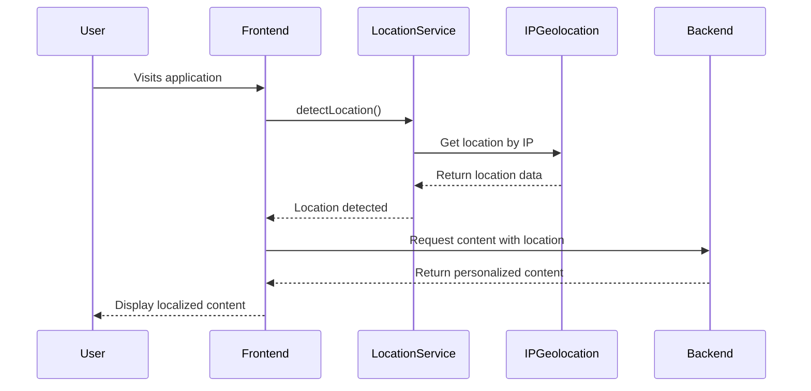
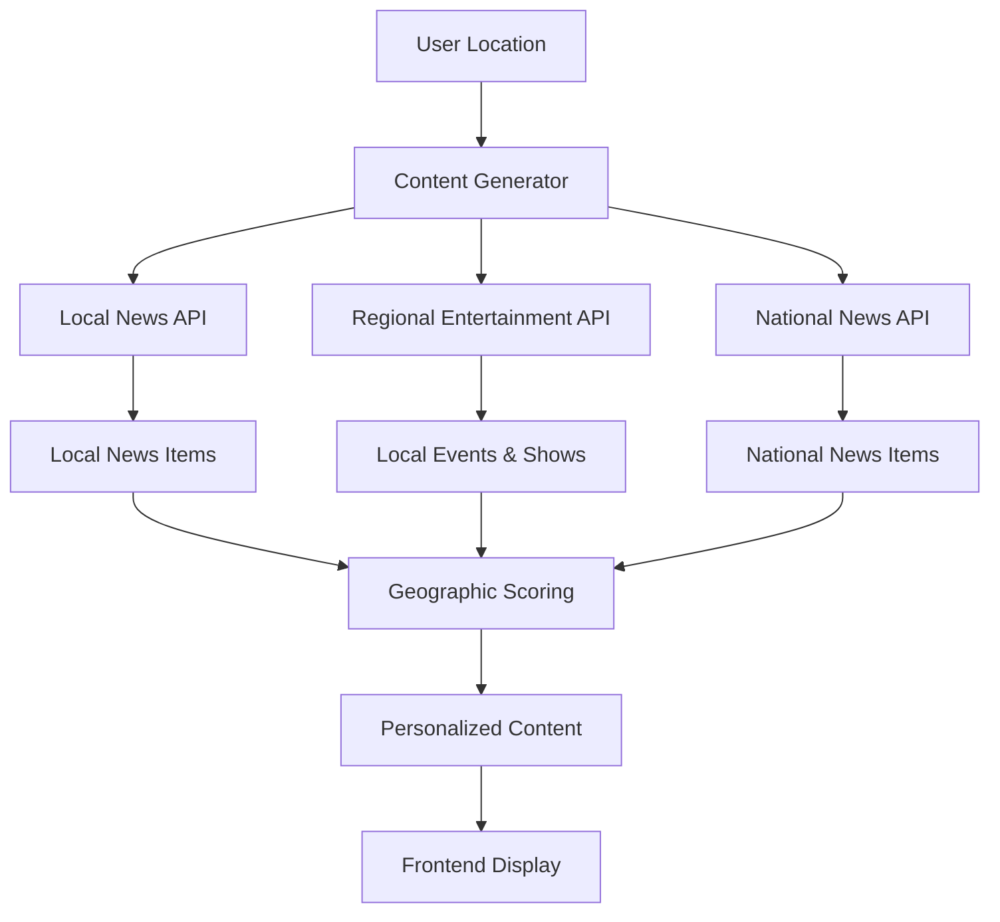

# Location-Based Personalization Design Document

## Overview

This design adds comprehensive geographic personalization to Curio News, enabling location-aware news content and entertainment recommendations. The system will detect user location and provide relevant local news, nearby entertainment options, and regionally appropriate content while maintaining privacy and performance standards.

## Architecture

### System Components

```
┌─────────────────────────────────────────────────────────────┐
│                    Frontend Layer                           │
├─────────────────────────────────────────────────────────────┤
│ Location Detection │ Location Settings │ Geographic UI      │
│ - IP Geolocation   │ - Manual Input    │ - Local News Badge │
│ - Browser API      │ - City/State      │ - Distance Display │
│ - User Preferences │ - Privacy Controls│ - Regional Indicators│
└─────────────────────────────────────────────────────────────┘
                              │
                              ▼
┌─────────────────────────────────────────────────────────────┐
│                    API Gateway                              │
├─────────────────────────────────────────────────────────────┤
│ Location Middleware │ Request Routing │ Response Caching    │
│ - Validate Location │ - Geographic    │ - Regional Cache    │
│ - Privacy Filtering │   Parameters    │ - Location-based    │
│ - Default Fallbacks │ - API Selection │   Content Storage   │
└─────────────────────────────────────────────────────────────┘
                              │
                              ▼
┌─────────────────────────────────────────────────────────────┐
│                Content Generation Layer                     │
├─────────────────────────────────────────────────────────────┤
│ Geographic News    │ Local Entertainment │ Regional Adaptation│
│ - Local News API   │ - Venue APIs        │ - Cultural Context │
│ - Regional Sources │ - Event Platforms   │ - Language Adapt   │
│ - Proximity Scoring│ - Distance Calc     │ - Local Preferences│
└─────────────────────────────────────────────────────────────┘
                              │
                              ▼
┌─────────────────────────────────────────────────────────────┐
│                   External Services                         │
├─────────────────────────────────────────────────────────────┤
│ News APIs          │ Entertainment APIs  │ Location Services  │
│ - NewsAPI (local)  │ - Ticketmaster     │ - IP Geolocation   │
│ - Local News Sites │ - Eventbrite       │ - Geocoding APIs   │
│ - Regional Sources │ - Theater APIs     │ - Distance Calc    │
└─────────────────────────────────────────────────────────────┘
```

## Components and Interfaces

### 1. Location Detection Service

**Frontend Location Detection**:
```typescript
interface LocationData {
  city: string;
  state: string;
  country: string;
  latitude?: number;
  longitude?: number;
  timezone: string;
  accuracy: 'precise' | 'city' | 'region' | 'country';
  source: 'ip' | 'browser' | 'manual';
  detected_at: string;
}

interface LocationService {
  detectLocation(): Promise<LocationData>;
  setManualLocation(city: string, state: string, country: string): LocationData;
  getCurrentLocation(): LocationData | null;
  clearLocation(): void;
  isLocationEnabled(): boolean;
}

class LocationDetector implements LocationService {
  async detectLocation(): Promise<LocationData> {
    try {
      // Try IP geolocation first (most reliable)
      const ipLocation = await this.getIPLocation();
      if (ipLocation) return ipLocation;
      
      // Fallback to browser geolocation (requires permission)
      const browserLocation = await this.getBrowserLocation();
      if (browserLocation) return browserLocation;
      
      // Ultimate fallback
      return this.getDefaultLocation();
    } catch (error) {
      console.warn('Location detection failed:', error);
      return this.getDefaultLocation();
    }
  }
  
  private async getIPLocation(): Promise<LocationData | null> {
    // Use ipapi.co or similar service
    const response = await fetch('https://ipapi.co/json/');
    const data = await response.json();
    
    return {
      city: data.city,
      state: data.region,
      country: data.country_name,
      timezone: data.timezone,
      accuracy: 'city',
      source: 'ip',
      detected_at: new Date().toISOString()
    };
  }
}
```

**Location Settings Component**:
```typescript
interface LocationSettingsProps {
  currentLocation: LocationData | null;
  onLocationChange: (location: LocationData) => void;
  onLocationDisable: () => void;
}

const LocationSettings: React.FC<LocationSettingsProps> = ({
  currentLocation,
  onLocationChange,
  onLocationDisable
}) => {
  const [isEditing, setIsEditing] = useState(false);
  const [manualCity, setManualCity] = useState('');
  const [manualState, setManualState] = useState('');
  
  return (
    <div className="location-settings">
      <div className="current-location">
        <h4>📍 Your Location</h4>
        {currentLocation ? (
          <div className="location-display">
            <span className="location-text">
              {currentLocation.city}, {currentLocation.state}
            </span>
            <span className="location-source">
              ({currentLocation.source} detection)
            </span>
          </div>
        ) : (
          <span className="no-location">Location not set</span>
        )}
      </div>
      
      <div className="location-actions">
        <button 
          className="edit-location-btn"
          onClick={() => setIsEditing(!isEditing)}
        >
          ✏️ Change Location
        </button>
        <button 
          className="disable-location-btn"
          onClick={onLocationDisable}
        >
          🚫 Disable Location
        </button>
      </div>
      
      {isEditing && (
        <div className="manual-location-form">
          <input
            type="text"
            placeholder="City"
            value={manualCity}
            onChange={(e) => setManualCity(e.target.value)}
          />
          <input
            type="text"
            placeholder="State/Province"
            value={manualState}
            onChange={(e) => setManualState(e.target.value)}
          />
          <button onClick={handleManualLocationSave}>
            Save Location
          </button>
        </div>
      )}
    </div>
  );
};
```

### 2. Geographic News Enhancement

**Enhanced News Interface**:
```typescript
interface GeographicNews extends NewsItem {
  geographic_relevance: {
    level: 'local' | 'regional' | 'national' | 'international';
    distance_km?: number;
    affected_areas: string[];
    local_impact_score: number; // 0-1
  };
  location_tags: {
    city?: string;
    state?: string;
    region?: string;
    country: string;
  };
}

interface LocalNewsCard {
  news: GeographicNews;
  userLocation: LocationData;
}

const LocalNewsCard: React.FC<LocalNewsCard> = ({ news, userLocation }) => {
  const getRelevanceBadge = () => {
    const { level, distance_km } = news.geographic_relevance;
    
    switch (level) {
      case 'local':
        return <span className="relevance-badge local">📍 Local</span>;
      case 'regional':
        return <span className="relevance-badge regional">🗺️ Regional</span>;
      case 'national':
        return <span className="relevance-badge national">🏛️ National</span>;
      default:
        return <span className="relevance-badge international">🌍 International</span>;
    }
  };
  
  return (
    <div className="geographic-news-card">
      <div className="news-header">
        {getRelevanceBadge()}
        {news.geographic_relevance.distance_km && (
          <span className="distance-badge">
            📏 {Math.round(news.geographic_relevance.distance_km)} km away
          </span>
        )}
      </div>
      
      <h5 className="news-title">{news.title}</h5>
      
      <div className="location-context">
        <span className="affected-areas">
          Affects: {news.geographic_relevance.affected_areas.join(', ')}
        </span>
      </div>
      
      <p className="news-summary">{news.summary}</p>
      
      <div className="news-meta">
        <span className="source">{news.source}</span>
        <span className="category">{news.category}</span>
      </div>
    </div>
  );
};
```

### 3. Location-Aware Entertainment

**Enhanced Entertainment Interfaces**:
```typescript
interface LocalTheaterPlay extends TheaterPlay {
  location_info: {
    venue_address: string;
    distance_km: number;
    travel_time_minutes: number;
    coordinates: {
      latitude: number;
      longitude: number;
    };
  };
  local_pricing: {
    currency: string;
    price_range: string;
    booking_url: string;
    availability_status: 'available' | 'limited' | 'sold_out';
  };
}

interface LocalEvent {
  title: string;
  type: 'concert' | 'festival' | 'comedy' | 'sports' | 'cultural';
  venue: string;
  date: string;
  time: string;
  description: string;
  location_info: {
    address: string;
    distance_km: number;
    travel_time_minutes: number;
  };
  ticket_info: {
    price_range: string;
    booking_url: string;
    availability: 'available' | 'limited' | 'sold_out';
  };
  local_popularity_score: number; // 0-1
}

const LocalEventCard: React.FC<{event: LocalEvent}> = ({ event }) => {
  return (
    <div className="local-event-card">
      <div className="event-header">
        <div className="event-type-badge">{event.type}</div>
        <div className="distance-info">
          📍 {event.location_info.distance_km.toFixed(1)} km
          • 🚗 {event.location_info.travel_time_minutes} min
        </div>
      </div>
      
      <h6 className="event-title">{event.title}</h6>
      
      <div className="event-details">
        <div className="venue-info">
          🏛️ {event.venue}
        </div>
        <div className="datetime-info">
          📅 {event.date} • 🕐 {event.time}
        </div>
      </div>
      
      <p className="event-description">{event.description}</p>
      
      <div className="ticket-section">
        <div className="price-info">
          💰 {event.ticket_info.price_range}
        </div>
        <div className="availability-status">
          🎫 {event.ticket_info.availability}
        </div>
        {event.ticket_info.booking_url && (
          <a 
            href={event.ticket_info.booking_url}
            target="_blank"
            rel="noopener noreferrer"
            className="book-tickets-btn"
          >
            Book Tickets
          </a>
        )}
      </div>
    </div>
  );
};
```

### 4. Backend Location Integration

**Enhanced Content Generator**:
```python
class LocationAwareContentGenerator(ContentGenerator):
    def __init__(self, curio_table: str):
        super().__init__(curio_table)
        self.location_services = LocationServices()
        self.news_apis = GeographicNewsAPIs()
        self.entertainment_apis = LocalEntertainmentAPIs()
    
    def generate_content(self, run_id: str = None, location_data: dict = None) -> Dict[str, Any]:
        """Generate location-aware content"""
        try:
            print(f"🌍 Starting location-aware content generation")
            
            # Parse and validate location
            user_location = self._parse_location(location_data)
            print(f"📍 User location: {user_location}")
            
            # Fetch location-aware news
            news_items = self._fetch_geographic_news(user_location)
            
            # Generate location-aware entertainment
            entertainment = self._generate_local_entertainment(user_location)
            
            # Create location-adapted script
            script = self._generate_location_aware_script(news_items, user_location)
            
            # Assemble with location context
            return self._assemble_location_aware_content(
                news_items, script, entertainment, user_location, run_id
            )
            
        except Exception as e:
            print(f"❌ Location-aware generation failed: {e}")
            # Fallback to general content
            return super().generate_content(run_id)
    
    def _fetch_geographic_news(self, location: dict) -> List[Dict]:
        """Fetch news with geographic relevance"""
        try:
            # Fetch local news
            local_news = self.news_apis.get_local_news(
                city=location.get('city'),
                state=location.get('state'),
                country=location.get('country')
            )
            
            # Fetch regional news
            regional_news = self.news_apis.get_regional_news(
                state=location.get('state'),
                country=location.get('country')
            )
            
            # Fetch national news
            national_news = self._fetch_news()  # Existing method
            
            # Combine and score by geographic relevance
            all_news = []
            
            # Add local news with high relevance
            for item in local_news[:3]:
                item['geographic_relevance'] = {
                    'level': 'local',
                    'local_impact_score': 0.9,
                    'affected_areas': [location.get('city', '')]
                }
                all_news.append(item)
            
            # Add regional news with medium relevance
            for item in regional_news[:2]:
                item['geographic_relevance'] = {
                    'level': 'regional',
                    'local_impact_score': 0.6,
                    'affected_areas': [location.get('state', '')]
                }
                all_news.append(item)
            
            # Add national news with lower relevance
            for item in national_news[:3]:
                item['geographic_relevance'] = {
                    'level': 'national',
                    'local_impact_score': 0.3,
                    'affected_areas': [location.get('country', '')]
                }
                all_news.append(item)
            
            return all_news[:8]  # Limit total items
            
        except Exception as e:
            print(f"❌ Geographic news fetch failed: {e}")
            return self._fetch_news()  # Fallback to general news
    
    def _generate_local_entertainment(self, location: dict) -> Dict[str, Any]:
        """Generate location-specific entertainment recommendations"""
        try:
            city = location.get('city', '')
            state = location.get('state', '')
            
            # Get local theater shows
            local_plays = self.entertainment_apis.get_theater_shows(city, state)
            
            # Get local events
            local_events = self.entertainment_apis.get_local_events(city, state)
            
            # Get streaming content (with regional availability)
            streaming_content = self.entertainment_apis.get_regional_streaming(
                country=location.get('country', 'US')
            )
            
            return {
                'local_theater_plays': local_plays[:3],
                'local_events': local_events[:5],
                'regional_streaming': streaming_content,
                'location_context': {
                    'city': city,
                    'state': state,
                    'entertainment_scene_description': f"Entertainment options in {city}, {state}"
                }
            }
            
        except Exception as e:
            print(f"❌ Local entertainment generation failed: {e}")
            return self._create_agent_outputs([])['weekendRecommendations']

class LocationServices:
    """Service for handling location-related operations"""
    
    def validate_location(self, location_data: dict) -> dict:
        """Validate and normalize location data"""
        required_fields = ['city', 'state', 'country']
        
        for field in required_fields:
            if not location_data.get(field):
                raise ValueError(f"Missing required location field: {field}")
        
        return {
            'city': location_data['city'].strip().title(),
            'state': location_data['state'].strip().upper(),
            'country': location_data['country'].strip().upper(),
            'timezone': location_data.get('timezone', 'UTC'),
            'coordinates': location_data.get('coordinates', {})
        }
    
    def calculate_distance(self, loc1: dict, loc2: dict) -> float:
        """Calculate distance between two locations in kilometers"""
        # Implement haversine formula or use external service
        # This is a simplified version
        try:
            lat1, lon1 = loc1.get('latitude', 0), loc1.get('longitude', 0)
            lat2, lon2 = loc2.get('latitude', 0), loc2.get('longitude', 0)
            
            # Haversine formula implementation
            from math import radians, cos, sin, asin, sqrt
            
            lat1, lon1, lat2, lon2 = map(radians, [lat1, lon1, lat2, lon2])
            dlat = lat2 - lat1
            dlon = lon2 - lon1
            a = sin(dlat/2)**2 + cos(lat1) * cos(lat2) * sin(dlon/2)**2
            c = 2 * asin(sqrt(a))
            r = 6371  # Radius of earth in kilometers
            
            return c * r
        except Exception:
            return 0.0  # Return 0 if calculation fails

class GeographicNewsAPIs:
    """APIs for fetching location-specific news"""
    
    def get_local_news(self, city: str, state: str, country: str) -> List[Dict]:
        """Fetch local news for specific city/state"""
        try:
            # Use NewsAPI with location parameters
            params = {
                'apiKey': NEWS_API_KEY,
                'q': f'"{city}" OR "{state}"',
                'language': 'en',
                'sortBy': 'relevancy',
                'pageSize': 5
            }
            
            response = requests.get(f"{NEWS_API_BASE_URL}/everything", params=params)
            data = response.json()
            
            local_news = []
            for article in data.get('articles', []):
                if self._is_local_relevant(article, city, state):
                    local_news.append(self._format_news_item(article))
            
            return local_news
            
        except Exception as e:
            print(f"❌ Local news fetch failed: {e}")
            return []
    
    def _is_local_relevant(self, article: dict, city: str, state: str) -> bool:
        """Check if article is relevant to local area"""
        text = f"{article.get('title', '')} {article.get('description', '')}".lower()
        return city.lower() in text or state.lower() in text

class LocalEntertainmentAPIs:
    """APIs for fetching location-specific entertainment"""
    
    def get_theater_shows(self, city: str, state: str) -> List[Dict]:
        """Fetch theater shows in the area"""
        # This would integrate with Ticketmaster, StubHub, or local theater APIs
        # For now, return mock data structure
        return [
            {
                'title': 'Hamilton',
                'venue': f'{city} Theater District',
                'show_times': 'Tue-Sun 8PM',
                'location_info': {
                    'distance_km': 5.2,
                    'travel_time_minutes': 15
                },
                'local_pricing': {
                    'price_range': '$79-$299',
                    'availability_status': 'available'
                }
            }
        ]
    
    def get_local_events(self, city: str, state: str) -> List[Dict]:
        """Fetch local events and activities"""
        # This would integrate with Eventbrite, Facebook Events, etc.
        return [
            {
                'title': f'{city} Music Festival',
                'type': 'festival',
                'venue': f'{city} Park',
                'date': 'This Weekend',
                'location_info': {
                    'distance_km': 8.1,
                    'travel_time_minutes': 20
                }
            }
        ]
```

## Data Flow and Integration

### 1. Location Detection Flow



### 2. Content Personalization Flow



## Privacy and Security

### 1. Data Protection
- Store only city/state level location (not precise coordinates)
- Use session-based storage (no persistent location tracking)
- Provide clear opt-out mechanisms
- Implement data encryption for location data

### 2. User Controls
- Manual location override
- Location disable option
- Privacy settings panel
- Clear data usage explanation

## Performance Considerations

### 1. Caching Strategy
- Cache location-based content by city/state
- Implement regional content CDN
- Use location-aware cache keys
- Set appropriate cache TTL for local vs national content

### 2. Fallback Mechanisms
- Graceful degradation when location services fail
- Default to general content if location-specific content unavailable
- Timeout protection for external location APIs
- Error handling for invalid location data

## Testing Strategy

### 1. Location Detection Testing
- Test IP geolocation accuracy
- Verify manual location input validation
- Test privacy controls functionality
- Validate fallback behavior

### 2. Content Personalization Testing
- Verify local news relevance
- Test entertainment filtering accuracy
- Validate distance calculations
- Test regional content adaptation

## Success Metrics

- **Relevance Score**: Measure user engagement with local vs general content
- **Location Accuracy**: Track successful location detection rates
- **Content Quality**: Monitor local content availability and freshness
- **User Satisfaction**: Survey users on personalization effectiveness
- **Performance Impact**: Ensure location features don't degrade performance