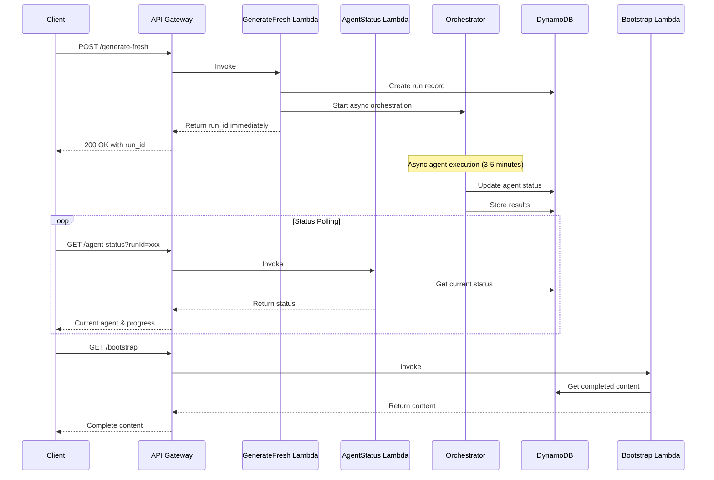

# System Reliability Fix Design Document

## Overview

This design transforms the Curio News system from a synchronous, timeout-prone architecture to a robust, asynchronous system with comprehensive error handling and monitoring. The core change is moving from blocking API calls to an event-driven architecture that can handle long-running agent orchestration while providing immediate feedback to clients.

## Architecture

### Current Architecture Issues
- **Synchronous Bottleneck**: `/generate-fresh` tries to complete entire orchestration in one API call
- **API Gateway Timeout**: 30-second hard limit conflicts with 180-second Lambda timeout
- **Cascade Failures**: Single agent failure kills entire workflow
- **Poor Observability**: Limited visibility into where failures occur

### New Asynchronous Architecture



## Components and Interfaces

### 1. Asynchronous Generation Handler

**Purpose**: Immediately return run ID while starting background orchestration

**Interface**:
```python
def generate_fresh_async(event, context) -> Dict[str, Any]:
    """
    Start asynchronous content generation
    Returns: {
        "success": True,
        "runId": "uuid-string",
        "statusUrl": "/agent-status?runId=uuid-string",
        "estimatedCompletionTime": "2024-10-21T14:30:00Z"
    }
    """
```

**Key Features**:
- Returns within 2 seconds
- Starts orchestration in background thread/process
- Creates comprehensive run tracking record
- Provides estimated completion time based on historical data

### 2. Enhanced Agent Orchestrator

**Purpose**: Execute agents with robust error handling and timeout management

**Interface**:
```python
class RobustAgentOrchestrator:
    def __init__(self):
        self.agent_timeout = 90  # Increased from 60s
        self.max_retries = 3
        self.circuit_breaker_threshold = 5
        self.fallback_enabled = True
    
    def orchestrate_with_resilience(self, run_id: str) -> Dict[str, Any]:
        """Execute all agents with comprehensive error handling"""
    
    def execute_agent_with_circuit_breaker(self, agent_name: str, prompt: str) -> AgentResult:
        """Execute single agent with circuit breaker pattern"""
```

**Key Features**:
- Circuit breaker pattern for external API calls
- Parallel agent execution where possible
- Graceful degradation on partial failures
- Comprehensive logging and metrics

### 3. Status Tracking System

**Purpose**: Provide real-time status updates for async operations

**Database Schema**:
```
DynamoDB Table: CurioTable
PK: generation#{run_id}
SK: status
Attributes:
- currentAgent: string
- status: STARTING|RUNNING|COMPLETED|FAILED
- startTime: ISO timestamp
- estimatedCompletion: ISO timestamp
- completedAgents: list
- failedAgents: list
- lastUpdated: ISO timestamp
- errorDetails: object (if failed)
```

**Status API Response**:
```json
{
  "runId": "uuid",
  "status": "RUNNING",
  "currentAgent": "SCRIPT_GENERATOR",
  "progress": {
    "completed": 3,
    "total": 6,
    "percentage": 50
  },
  "estimatedTimeRemaining": 120,
  "completedAgents": ["NEWS_FETCHER", "CONTENT_CURATOR", "FAVORITE_SELECTOR"],
  "failedAgents": [],
  "lastUpdated": "2024-10-21T14:25:30Z"
}
```

### 4. Circuit Breaker Implementation

**Purpose**: Prevent cascade failures from external service issues

```python
class CircuitBreaker:
    def __init__(self, failure_threshold=5, recovery_timeout=60):
        self.failure_threshold = failure_threshold
        self.recovery_timeout = recovery_timeout
        self.failure_count = 0
        self.last_failure_time = None
        self.state = "CLOSED"  # CLOSED, OPEN, HALF_OPEN
    
    def call(self, func, *args, **kwargs):
        """Execute function with circuit breaker protection"""
```

**States**:
- **CLOSED**: Normal operation, calls pass through
- **OPEN**: Failures exceeded threshold, calls fail fast
- **HALF_OPEN**: Testing if service recovered

### 5. Enhanced Fallback System

**Purpose**: Provide graceful degradation when agents fail

**Fallback Hierarchy**:
1. **Recent Cache**: Use content from last 2 hours if available
2. **Partial Content**: Continue with successful agents only
3. **Static Fallback**: Pre-generated emergency content
4. **Error Response**: Structured error with retry information

**Implementation**:
```python
class FallbackContentManager:
    def get_fallback_content(self, failed_sections: List[str], 
                           successful_content: Dict) -> Dict[str, Any]:
        """Generate fallback content for failed sections"""
    
    def create_partial_content_response(self, content: Dict, 
                                      failed_sections: List[str]) -> Dict[str, Any]:
        """Create response indicating partial content"""
```

## Data Models

### Run Tracking Model
```python
@dataclass
class OrchestrationRun:
    run_id: str
    status: str  # STARTING, RUNNING, COMPLETED, FAILED, PARTIAL
    start_time: datetime
    estimated_completion: datetime
    current_agent: Optional[str]
    completed_agents: List[str]
    failed_agents: List[str]
    error_details: Optional[Dict]
    performance_metrics: Dict
    fallback_sections: List[str]
```

### Agent Execution Result
```python
@dataclass
class AgentExecutionResult:
    agent_name: str
    success: bool
    execution_time: float
    retry_count: int
    error_category: Optional[str]
    content: Optional[str]
    fallback_used: bool
    circuit_breaker_triggered: bool
```

## Error Handling

### Error Categories
1. **Timeout Errors**: Agent execution exceeds time limit
2. **External API Errors**: NewsAPI, Bedrock, Polly failures
3. **Content Validation Errors**: Generated content doesn't meet quality standards
4. **System Resource Errors**: Memory, CPU, or network constraints
5. **Configuration Errors**: Missing environment variables or permissions

### Error Recovery Strategies

**Timeout Recovery**:
```python
def handle_agent_timeout(agent_name: str, run_id: str):
    1. Log timeout event with context
    2. Check if agent can be retried with extended timeout
    3. If max retries exceeded, mark agent as failed
    4. Continue orchestration with remaining agents
    5. Use fallback content for timed-out agent
```

**External API Recovery**:
```python
def handle_external_api_failure(service: str, error: Exception):
    1. Check circuit breaker state
    2. If circuit open, use cached/fallback content
    3. If circuit closed, retry with exponential backoff
    4. Update circuit breaker failure count
    5. Log failure for monitoring
```

### Graceful Degradation Matrix

| Failed Agents | System Response | User Experience |
|---------------|----------------|-----------------|
| NEWS_FETCHER | Use cached news + static content | Slightly stale news |
| SCRIPT_GENERATOR | Use template + news summaries | Basic script format |
| MEDIA_ENHANCER | Skip media enhancements | No image recommendations |
| WEEKEND_EVENTS | Use static recommendations | Generic weekend content |
| Multiple Critical | Partial content + clear messaging | Transparent about limitations |
| All Agents | Emergency static content | Apologetic but functional |

## Testing Strategy

### Unit Tests
- Circuit breaker state transitions
- Timeout handling logic
- Fallback content generation
- Status tracking updates

### Integration Tests
- End-to-end async workflow
- Agent failure scenarios
- External API timeout simulation
- Database consistency during failures

### Performance Tests
- Concurrent orchestration runs
- Memory usage during long operations
- Database query performance under load
- Circuit breaker behavior under stress

### Reliability Tests (Updated)
```python
class ReliabilityTestConfig:
    test_timeout = 360  # 6 minutes (was 20 seconds)
    polling_interval = 5  # Poll every 5 seconds
    max_polls = 72  # 6 minutes / 5 seconds
    success_threshold = 80  # 80% success rate required
    partial_success_acceptable = True  # Accept partial content
```

## Performance Optimizations

### 1. Parallel Agent Execution
- Execute independent agents concurrently
- NEWS_FETCHER and CONTENT_CURATOR can run in parallel
- MEDIA_ENHANCER and WEEKEND_EVENTS can run in parallel
- SCRIPT_GENERATOR depends on news content

### 2. Intelligent Caching
- Cache external API responses for 15 minutes
- Cache successful agent outputs for 2 hours
- Use cached content during circuit breaker OPEN state
- Implement cache warming for popular content

### 3. Resource Management
- Monitor Lambda memory usage and adjust
- Implement connection pooling for external APIs
- Use DynamoDB batch operations where possible
- Optimize JSON serialization/deserialization

### 4. Monitoring and Alerting

**CloudWatch Metrics**:
- Agent execution times (per agent)
- Success/failure rates (per agent and overall)
- Circuit breaker state changes
- Fallback content usage
- API response times

**Alerts**:
- Overall success rate < 70% (5-minute window)
- Any agent success rate < 50% (10-minute window)
- Circuit breaker OPEN for > 5 minutes
- Average orchestration time > 4 minutes

## Migration Strategy

### Phase 1: Async Foundation (Week 1)
1. Implement async `/generate-fresh` endpoint
2. Add comprehensive status tracking
3. Update tests to use polling pattern
4. Deploy and validate basic async flow

### Phase 2: Resilience Features (Week 2)
1. Implement circuit breaker pattern
2. Add enhanced fallback system
3. Improve error categorization and handling
4. Add performance monitoring

### Phase 3: Optimization (Week 3)
1. Enable parallel agent execution
2. Implement intelligent caching
3. Add predictive completion times
4. Fine-tune timeout and retry parameters

### Phase 4: Monitoring & Alerting (Week 4)
1. Set up comprehensive CloudWatch dashboards
2. Configure alerting rules
3. Add automated recovery procedures
4. Document troubleshooting procedures

This design addresses all the reliability issues identified in the test results while maintaining backward compatibility and providing a clear migration path.