# Curio News - Mermaid Diagrams for Thumbnails 🎨

## 📅 Project Timeline

**Started**: October 2nd, 2025
**Duration**: 19 days of development
**Status**: Production-ready with comprehensive testing

---

## 🤖 Multi-Agent Architecture Diagram

### Option 1: Circular Agent Flow

### Option 2: Horizontal Flow

```mermaid
flowchart LR
    A[🎯 User Request] --> B[🧠 Agent<br/>Orchestrator]

    B --> C[📰 NEWS<br/>FETCHER]
    B --> D[🎯 CONTENT<br/>CURATOR]
    B --> E[⭐ FAVORITE<br/>SELECTOR]
    B --> F[✍️ SCRIPT<br/>GENERATOR]
    B --> G[🎨 MEDIA<br/>ENHANCER]
    B --> H[🎉 WEEKEND<br/>EVENTS]

    C --> I[🔧 Assembly]
    D --> I
    E --> I
    F --> I
    G --> I
    H --> I

    I --> J[🎵 Audio<br/>Generation]
    J --> K[📱 Interactive<br/>Response]

    style A fill:#ff9900,stroke:#232f3e,stroke-width:3px,color:#fff
    style B fill:#232f3e,stroke:#ff9900,stroke-width:3px,color:#fff
    style C fill:#e1f5fe,stroke:#01579b,stroke-width:2px,color:#000
    style D fill:#e1f5fe,stroke:#01579b,stroke-width:2px,color:#000
    style E fill:#e1f5fe,stroke:#01579b,stroke-width:2px,color:#000
    style F fill:#e1f5fe,stroke:#01579b,stroke-width:2px,color:#000
    style G fill:#e1f5fe,stroke:#01579b,stroke-width:2px,color:#000
    style H fill:#e1f5fe,stroke:#01579b,stroke-width:2px,color:#000
    style I fill:#fff3e0,stroke:#e65100,stroke-width:2px,color:#000
    style J fill:#f3e5f5,stroke:#4a148c,stroke-width:2px,color:#000
    style K fill:#ff9900,stroke:#232f3e,stroke-width:3px,color:#fff
```

### Option 3: Hub and Spoke (Great for Thumbnails)

```mermaid
graph TB
    subgraph "Curio News - Multi-Agent AI Platform"
        A[🧠 ORCHESTRATOR<br/>Central Hub]

        A --- B[📰 NEWS<br/>FETCHER]
        A --- C[🎯 CURATOR]
        A --- D[⭐ FAVORITE<br/>SELECTOR]
        A --- E[✍️ SCRIPT<br/>GENERATOR]
        A --- F[🎨 MEDIA<br/>ENHANCER]
        A --- G[🎉 WEEKEND<br/>EVENTS]

        A --> H[🎵 Audio + Interactive Transcript]
    end

    style A fill:#232f3e,stroke:#ff9900,stroke-width:4px,color:#fff
    style B fill:#e3f2fd,stroke:#1976d2,stroke-width:3px,color:#000
    style C fill:#e3f2fd,stroke:#1976d2,stroke-width:3px,color:#000
    style D fill:#e3f2fd,stroke:#1976d2,stroke-width:3px,color:#000
    style E fill:#e3f2fd,stroke:#1976d2,stroke-width:3px,color:#000
    style F fill:#e3f2fd,stroke:#1976d2,stroke-width:3px,color:#000
    style G fill:#e3f2fd,stroke:#1976d2,stroke-width:3px,color:#000
    style H fill:#ff9900,stroke:#232f3e,stroke-width:4px,color:#fff
```

## 🏗 AWS Architecture Diagram - EXACT INFRASTRUCTURE

### Detailed AWS Services with Exact Counts

```mermaid
graph TD
    A[👤 User] --> B[🌐 S3 Static Website<br/>Frontend Hosting]
    B --> C[🚪 API Gateway<br/>1 REST API<br/>15 Endpoints]
    C --> D[⚡ AWS Lambda<br/>15 Functions]

    D --> E[🤖 AWS Bedrock<br/>6 Claude Haiku Agents<br/>NEWS_FETCHER<br/>CONTENT_CURATOR<br/>FAVORITE_SELECTOR<br/>SCRIPT_GENERATOR<br/>MEDIA_ENHANCER<br/>WEEKEND_EVENTS]
    D --> F[🗄️ DynamoDB<br/>1 Table: CurioTable<br/>Agent Status & Content<br/>GSI + TTL + Streams]
    D --> G[🎵 Amazon Polly<br/>Neural Voice: Joanna<br/>Text-to-Speech + Timing]

    E --> H[📦 S3 Assets Bucket<br/>Audio Storage<br/>Lifecycle Policies<br/>CORS Enabled]
    G --> H

    H --> I[📱 React Frontend<br/>Real-time Monitoring<br/>Interactive Transcripts<br/>Debugging Dashboard]

    J[⏰ EventBridge<br/>2 Scheduled Rules<br/>Morning & Evening<br/>Auto Generation] --> D

    K[📊 CloudWatch<br/>Metrics & Logs<br/>Performance Monitoring<br/>Alarms & Alerts] --> D

    style A fill:#ff9900,stroke:#232f3e,stroke-width:3px,color:#fff
    style B fill:#569a31,stroke:#232f3e,stroke-width:2px,color:#fff
    style C fill:#ff9900,stroke:#232f3e,stroke-width:2px,color:#fff
    style D fill:#ff9900,stroke:#232f3e,stroke-width:2px,color:#fff
    style E fill:#232f3e,stroke:#ff9900,stroke-width:3px,color:#fff
    style F fill:#3f51b5,stroke:#232f3e,stroke-width:2px,color:#fff
    style G fill:#9c27b0,stroke:#232f3e,stroke-width:2px,color:#fff
    style H fill:#569a31,stroke:#232f3e,stroke-width:2px,color:#fff
    style I fill:#ff9900,stroke:#232f3e,stroke-width:3px,color:#fff
    style J fill:#4caf50,stroke:#232f3e,stroke-width:2px,color:#fff
    style K fill:#2196f3,stroke:#232f3e,stroke-width:2px,color:#fff
```

### Alternative: Layered Architecture View

## 🎯 Simple Logo-Style Diagram

### Option 5: Minimal for Thumbnails

## 📊 Performance Metrics Diagram

### Option 6: Stats for Thumbnail

```mermaid
graph TD
    A[⚡ CURIO NEWS PERFORMANCE]
    A --> B[🚀 0.33s Response Time]
    A --> C[✅ 100% Success Rate]
    A --> D[🎯 1.0/1.0 Quality Score]
    A --> E[👥 5+ Concurrent Users]
    A --> F[🤖 6 AI Agents]
    A --> G[☁️ AWS Production Ready]

    style A fill:#232f3e,stroke:#ff9900,stroke-width:4px,color:#fff
    style B fill:#4caf50,stroke:#232f3e,stroke-width:2px,color:#fff
    style C fill:#4caf50,stroke:#232f3e,stroke-width:2px,color:#fff
    style D fill:#4caf50,stroke:#232f3e,stroke-width:2px,color:#fff
    style E fill:#2196f3,stroke:#232f3e,stroke-width:2px,color:#fff
    style F fill:#ff9900,stroke:#232f3e,stroke-width:2px,color:#fff
    style G fill:#ff5722,stroke:#232f3e,stroke-width:2px,color:#fff
```

---

## 🎨 How to Use These for Thumbnails

### Method 1: Mermaid Live Editor

1. Go to **mermaid.live**
2. Paste any of the above code
3. Adjust colors/styling as needed
4. Export as PNG/SVG
5. Convert to JPG if needed

### Method 2: GitHub/GitLab

1. Create a markdown file with the mermaid code
2. View it on GitHub (renders automatically)
3. Take a screenshot
4. Crop and enhance

### Method 3: VS Code Extension

1. Install "Mermaid Preview" extension
2. Create .md file with mermaid code
3. Preview and screenshot

## 🎯 Recommended for Thumbnail

**Option 3 (Hub and Spoke)** is probably best for thumbnails because:

- Clear central concept (orchestrator)
- Shows all 6 agents clearly
- Easy to read at small sizes
- Professional but approachable

## 🎨 Color Scheme Reference

- **AWS Orange**: #ff9900
- **AWS Dark Blue**: #232f3e
- **Light Blue**: #00d4ff
- **Success Green**: #4caf50
- **Tech Blue**: #2196f3

---

**💡 Pro Tip**: Use Option 3 or 5 for the cleanest thumbnail that will be readable even at small sizes!
